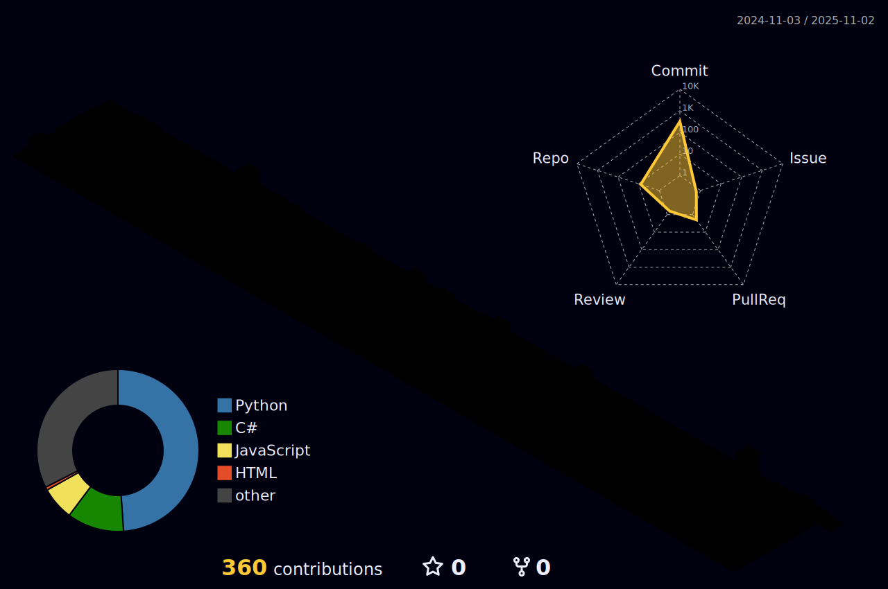

# Park Sehun Github 
# 1. My Skills

# 2. My Status

# 3. My Projects
- Sejong Univ. 소프프트웨어 설계 기초 SW_CTR [리포지토리 URL](https://github.com/david8575/SW-CTR)
- Sejong Univ. Capstone Design 과시리 [리포지토리 URL](https://github.com/david8575/Capstone-Design)
